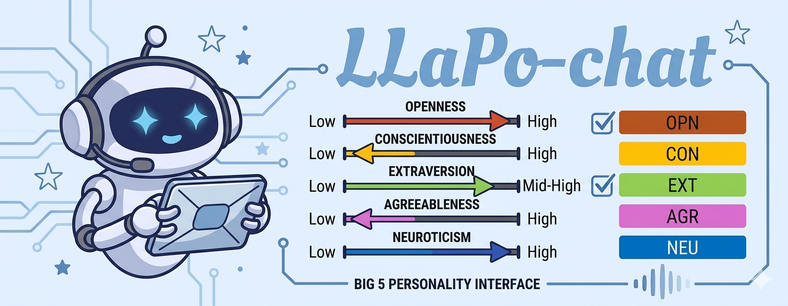
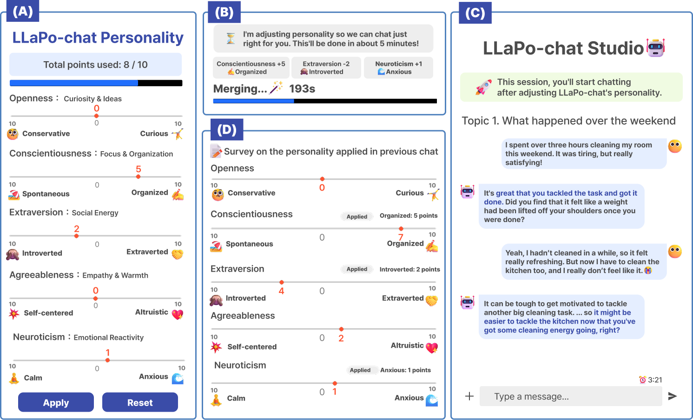

# LLaPo-chat (사용자 조절형 AI 성격 챗봇)

  

사용자가 슬라이더로 AI의 성격을 조절하고, 그 조절 경험이 대화 UX에 어떤 영향을 주는지 검증한 사용자 중심 챗봇 시스템입니다.

## Overview

LLaPo-chat은 Personality Vector Merging 기반 성격 제어 기술을 사용자 인터페이스로 확장한 시스템입니다.  
사용자는 Big Five 성격 축을 조절한 뒤, 적용된 성격으로 챗봇과 대화할 수 있습니다.

이 레포는 기술 자체보다 다음 질문에 초점을 둡니다.

- 사용자가 AI의 성격을 직접 조절할 수 있는가
- 조절 경험이 만족도, 즐거움, 통제감에 어떤 영향을 주는가
- 고정형 모델보다 사용자 조절형 모델이 더 나은 경험을 만드는가

## What this repository covers

- slider 기반 성격 조절 인터페이스
- merge → conversation → reset/survey 흐름
- LLaPo-chat vs. LLaPo-base 비교 구조
- 사용자 실험 절차 및 UX 평가 설계
- 서비스 관점의 personality control system 구현

## System flow

  

LLaPo-chat은 다음 흐름으로 동작합니다.

1. 사용자가 Big Five trait를 슬라이더로 조절
2. 선택된 성격 벡터를 모델에 병합
3. 적용된 성격으로 챗봇과 대화
4. 필요 시 reset 후, 사용자가 실제로 느낀 성격과 경험을 기록

이 구조를 통해 사용자가 설정한 성격과 실제 체감한 성격 사이의 관계를 함께 관찰할 수 있도록 설계했습니다.

## Control design

성격 조절은 Big Five 각 trait에 대한 슬라이더 입력을 기반으로 이루어집니다.  
각 trait에는 정해진 포인트를 부여할 수 있으며, 전체 설정은 제한된 예산 안에서 조합되도록 설계했습니다.

이 방식은 두 가지 목적을 가집니다.

- 사용자가 여러 성격 trait를 직접 조합할 수 있도록 함
- 실험 조건이 지나치게 분산되지 않도록 설정 범위를 일정하게 유지함

슬라이더 입력은 모델 병합 계수로 선형 매핑되어 대화 전에 반영됩니다.

## Experimental setup

- 비교 조건: `LLaPo-chat` vs. `LLaPo-base`
- 참가자: 30명
- 설계: within-subject
- 대화 세션: 3개 주제, 각 5분
- 측정 항목: Satisfaction, Enjoyment, User-control

## Study procedure

실험은 오리엔테이션 이후 두 조건을 모두 경험하는 방식으로 진행했습니다.

- Big Five 설명 및 사용 방법 안내
- 튜토리얼 진행
- `LLaPo-chat` / `LLaPo-base` 세션 수행
- 각 세션에서 3개 주제에 대해 대화
- 세션 종료 후 사후 설문 응답

LLaPo-chat 조건에서는 성격 조절과 병합 단계를 거친 뒤 대화를 진행했고,  
LLaPo-base 조건에서는 동일한 흐름에서 성격 조절 기능만 제외했습니다.

## Key findings

- 사용자 조절 기능이 있는 조건에서 전반적 경험 평가가 더 높게 나타남
- 특히 Enjoyment 측면에서 차이가 두드러짐
- 동일한 백본 모델에서도 사용자에게 조절 권한을 주는 방식이 UX에 영향을 줄 수 있음을 확인함

## Ethics

본 사용자 연구는 IRB 승인 후 진행되었으며, 참가자 동의를 바탕으로 데이터를 수집했습니다.

## Repository structure

- `image/`  
  시스템 화면 및 설명 이미지

- `docs/`  
  PRD 및 실험 설계 문서

## Recommended entry points

1. `README.md`
2. `image/LLaPo-chat-main.png`
3. `image/llapo-chat-flow.png`
4. `docs/PRDv3_최종.md`

## Research context

LLaPo-chat은 personality vector 기반 기술을 사용자 조절형 서비스로 확장한 프로젝트입니다.  
기술 구현 자체는 별도 레포인 `personality-vector-llm-control`에서 다루고, 이 레포는 시스템 설계와 UX 검증에 집중합니다.

## Thesis

**One Model Fits You: Controlling Large Language Models through Personality Vector Merging**

## Related technical paper

**Personality Vector: Modulating Personality of Large Language Models by Model Merging**  
EMNLP 2025 Main Conference  
[arXiv](https://arxiv.org/abs/2509.19727)
